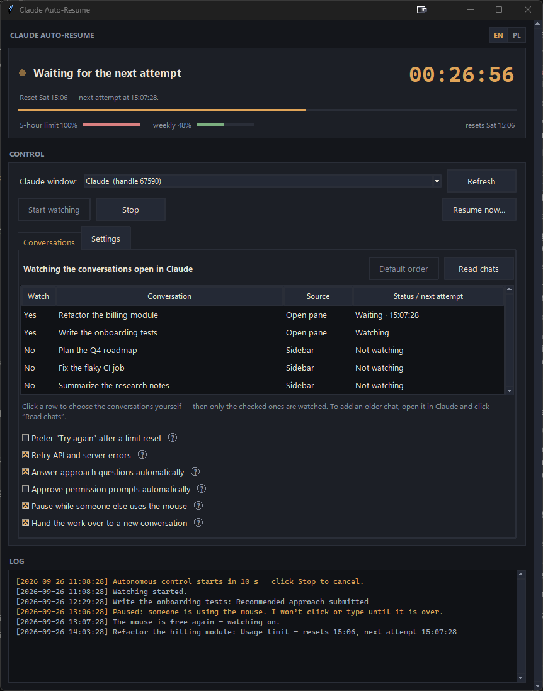
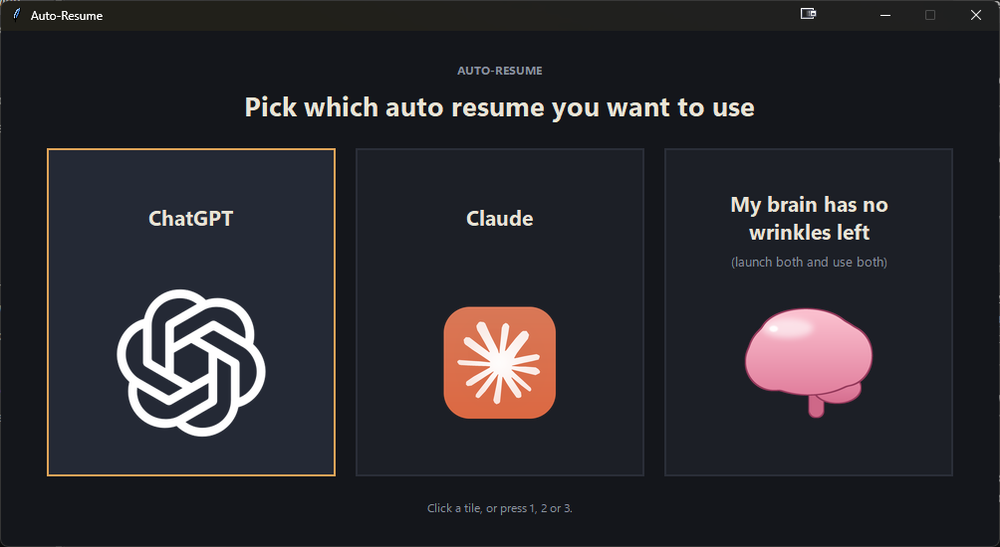
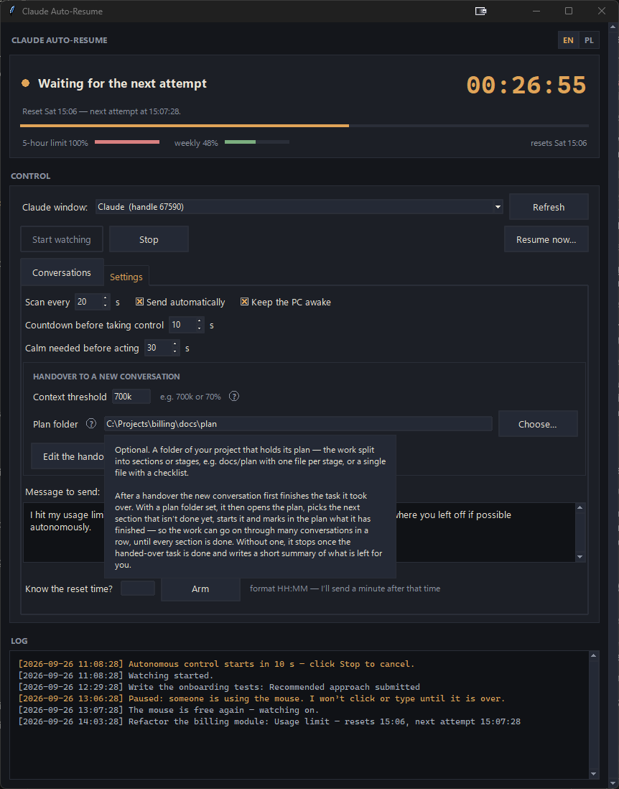
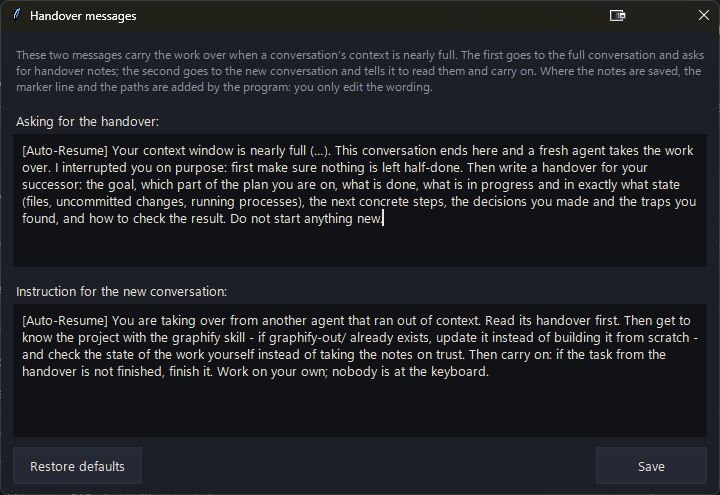
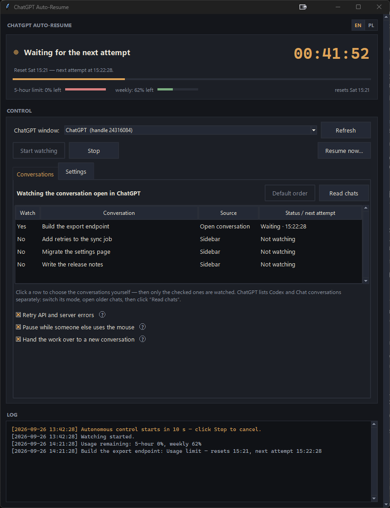

# Claude & ChatGPT Desktop App Auto-Resume for Windows 11

**Don't let the 5-hour limit stop Claude — or ChatGPT — in the middle of an overnight run.**

When your session limit runs out in the **Claude Desktop** app (Windows), work
just stops until you manually type "continue". This tool watches the Claude
window for you: it detects when the limit is hit, remembers the reset time, and
**one minute after the reset it tells the agent that the limit has reset and to
carry on, and presses Enter by itself**. You can leave it running while you are away.

The same tool now also works with the **ChatGPT desktop app** (its Codex
conversations): **ChatGPT Auto-Resume** checks the remaining limit the way you
would — user button in the bottom-left corner → **Usage remaining** — and resumes
the stopped conversation after the reset. Start **`Main.bat`** and pick
**ChatGPT**, **Claude**, or **My brain has no wrinkles left** to run both at once.

It can also watch **several conversations and split views**, retry **API and
server errors**, and optionally answer Claude's **approach questions** and
approve its **permission prompts** for you. When a conversation's **context
window fills up**, it can ask the agent for a handover and start a fresh
conversation in the same project to carry the work on. And it **keeps its hands
off the mouse** whenever you or an agent are using it.

It's the Windows-desktop counterpart to the popular Linux `claude-auto-retry`
(which only works in the terminal on Linux). This one drives the **Claude
desktop app on Windows 10/11**.

The interface is bilingual — **English / Polish**, switchable with the EN/PL
toggle in the top-right corner (English by default). The log follows the toggle
too, including the lines written before you switched.



*The screenshots show sample conversations.*

---

## Features

**Resuming after a limit**
- Recognizes the limit where it happens — Claude's *"Session limit reached"* card
  and *"Usage limit reached"* strip, ChatGPT's *"You've hit your usage limit"* — and
  finds the reset time in the notice, the usage meter, the usage panel (ChatGPT:
  **Usage remaining** in the profile menu) or the apps' own local logs.
- A minute after the reset it sends your message — by default *"I hit my usage limit
  while you were working, but it has reset now. Please continue from where you left
  off if possible autonomously."* — or clicks **Try again** if you prefer
  ([Custom message](#custom-message), [Try again](#use-the-try-again-button)).
- Never types into a conversation that is still blocked, still working, or holds a
  draft of yours. Each conversation has its own timer and status.
- **Resume now…** and **Know the reset time? → Arm** to do it by hand. Keeps the PC
  awake while it waits.

**Watching conversations**
- Watches the conversations open in Claude, split views included — or exactly the
  ones you tick in the list, visiting older ones from the sidebar
  ([Multiple conversations](#multiple-conversations-and-split-views)).
- A sortable list with each conversation's status and next attempt, a start
  countdown before it takes control, and a header with the state, a countdown clock
  and the 5-hour / weekly usage.

**Beyond the limit** (each optional)
- [Retries API and server errors](#retry-api-and-server-errors) — up to 6 times,
  backing off to 15 minutes.
- [Answers approach questions](#answer-approach-questions-automatically) with the
  option marked *Recommended*, or asks Claude to choose.
- [Approves permission prompts](#approve-permission-prompts-automatically) —
  *Always allow* or *Allow once*, never *Deny*.
- [Hands the work over](#hand-the-work-over-when-the-context-fills-up) when a
  conversation's context fills up: the agent writes a handover, and a fresh
  conversation in the same project reads it and carries on — section by section
  through your plan, if you give it one.

**Staying out of your way**
- [Holds still](#wait-while-someone-else-uses-the-mouse) while you use the mouse or
  keyboard, while Claude runs its computer-use tools and while ChatGPT drives your
  computer.
- Claude's and ChatGPT's Auto-Resume run side by side and take turns at the
  keyboard; two copies never watch the same window.

**ChatGPT too, and both at once**
- [ChatGPT Auto-Resume](#chatgpt-auto-resume) does the same for the ChatGPT desktop
  app's Codex conversations.
- `Main.bat` opens a picker: **ChatGPT**, **Claude**, or
  [both side by side](#both-at-once--my-brain-has-no-wrinkles-left). It brings a
  minimized app back on screen and arranges app windows that would hide each other.

**Easy to use**
- English and Polish, the log included; a **?** next to every option that explains
  it in plain words; a dark theme. Nothing to configure before the first run.

---

## How it works — in short

1. **Watches your conversations** every ~20 seconds. Unless you pick them
   yourself, those are the ones open in Claude, split views included; tick
   conversations in the list and it watches exactly those, visiting them from the
   sidebar when needed. It reads the interface like a screen reader — no
   screenshots, no OCR.
2. **Looks for Claude's limit notice first.** In Code sessions that is the
   **"Session limit reached"** card at the end of the conversation; elsewhere the
   "Usage limit reached" strip next to the chat box. That notice is Claude's own
   "session blocked" signal, so it's the primary trigger — the usage meter can lag
   or stick below 100% while the session is already blocked.
3. **Finds the reset time.** Claude doesn't always print it on the notice
   (*"Try again after your session limit resets."*), so the tool checks, in turn:
   the notice text, the usage meter in the bottom bar
   (*"100% of 5-hour limit, Resets at 9:30 AM"*), and the exact reset time that
   Claude Code writes to its local log when a request is rejected. As a last
   resort it opens Claude's usage panel and reads the **5-hour limit** row —
   ignoring the weekly and per-model limits, so a maxed-out weekly (e.g. Fable)
   limit never triggers a false alarm.
4. **Never types into a blocked conversation.** If no reset time can be found,
   it waits until the notice disappears — or at most 5 hours, the length of the
   limit window — instead of retrying blindly.
5. **One minute after the reset** it brings the interrupted conversation to the
   front and sends your message — by default *"I hit my usage limit while you
   were working, but it has reset now. Please continue from where you left off if
   possible autonomously."* You can also choose to use **Try again** when that
   button is available. Each conversation has its own timer, so one waiting chat
   does not hold up the others.

6. **Waits while someone else is using the mouse.** Every click and keystroke of
   its own is a brief takeover of your mouse and keyboard, so it holds still when
   you are typing, when Claude is running its **computer-use** tools (its own
   session log says so) and when ChatGPT shows its *"is using your computer"*
   overlay. It carries on after a few seconds of calm.

While it waits for the reset, it also **keeps the PC from going to sleep**, so
the overnight send actually happens.

---

## Installation

### What you need

- **Windows 10 or 11**
- **Python 3.10+** — check in a terminal: `py --version`.
  (You can get it from [python.org](https://www.python.org/downloads/) and
  tick *"Add Python to PATH"* during install.)
- The **Claude Desktop** app and/or the **ChatGPT** desktop app, installed and
  signed in.

### Get it and run

```powershell
git clone https://github.com/MichalCholajczyk/claude-desktop-auto-resume.git
cd claude-desktop-auto-resume
```

Then just double-click **`Main.bat`** — it installs the one dependency it needs
and opens a small window: *"Pick which auto resume you want to use"*, with three
big tiles:

| Tile | Starts |
|---|---|
| **ChatGPT** | ChatGPT Auto-Resume |
| **Claude** | Claude Auto-Resume |
| **My brain has no wrinkles left** *(launch both and use both)* | both, side by side |



Click a tile or press **1**, **2** or **3**. The pictures ship with the program (`assets/`), so every copy shows them, with or
without the apps or Pillow installed. A tile whose program is already open brings
that window forward instead of opening a second copy, and if the app a tile
watches is minimized, the picker puts it back on screen first (a minimized window
can't be read). `run.bat` still starts Claude Auto-Resume directly.

Prefer to do it by hand?

```powershell
py -m pip install --user uiautomation
py launcher.py                 # the picker
py claude_auto_continue.py     # Claude Auto-Resume
py chatgpt_auto_continue.py    # ChatGPT Auto-Resume
```

---

## First run

1. Open **Claude Desktop** and the conversations you want to continue.
2. Start this tool (`Main.bat` → **Claude**, or `run.bat`). You'll see a dark panel
   with a big clock.
3. Check the **"Claude window"** field at the top. Click **"Refresh"** to reload
   both the window list and the conversation list.
4. On the **Conversations** tab, click **Read chats**. With nothing checked, the
   conversations open in Claude (split views included) are watched — **Yes** in
   the *Watch* column — and the line above the list says so. Click a row to check
   or uncheck it: from then on exactly the checked conversations are watched
   (*Watching the checked conversations (2)*). Uncheck them all to go back to the
   open ones.
5. Set your message on the **Settings** tab and choose any optional features below.
   Not sure what an option does? Hover over (or click) the **?** next to it for a
   plain-language explanation.
6. Click **"Start watching"**. The tool first counts down (10 seconds by default)
   — *"Autonomous control in 10 s"* — so you can let go of the mouse and keyboard
   before it starts switching conversations. Click **"Stop"** to cancel. Then
   leave it running in the background.

A green lamp means "watching". When a limit is detected, the clock counts down
to the next attempt. The conversation list shows each chat's status separately.
Click a column header to sort the list (click again to reverse it);
**Default order** puts it back in Claude's order, newest conversation first.

To resume immediately, click **"Resume now…"** and confirm. This applies to every
conversation marked **Yes** in the list, so check the list first.

> **Couldn't read the reset time?** Type it into the **"Know the reset time?"**
> field (format `HH:MM`) and click **"Arm"** — the tool will resume the chosen
> conversations one minute after that time (if watching is off, the start
> countdown runs first). Timers are not saved when you close the tool; start
> watching again after restarting it.

### Custom message

By default the tool sends:

> I hit my usage limit while you were working, but it has reset now. Please
> continue from where you left off if possible autonomously.

It tells the agent why it stopped, so it picks the work up instead of asking what
a bare "continue" refers to. You can send anything you like: type your own text
into the **"Message to send"** box on the **Settings** tab. It is used after a
reset and by **"Resume now…"**. Leave it blank to fall back to the default. (A
settings file from an older version may still hold `continue`; clear the box to
get the new default.)

The box takes long prompts: it wraps and scrolls, and you can drag the handle
underneath it to make it taller (the height is remembered between runs). What
you type is sent as **one message**, so line breaks are collapsed into spaces —
Enter submits in Claude's composer, so a line break inside the message would
send it half-written.

### Multiple conversations and split views

With nothing checked, the tool watches the chats currently open in the selected
Claude window, including Code split views. Browser and terminal panes are ignored.

To choose yourself, click **Read chats**, then click the rows you want. The first
click turns the conversations shown as watched into checks, so only the row you
clicked changes; from then on exactly the checked conversations are watched, and
the tool visits them from the sidebar when they aren't open. Uncheck them all to
go back to the open ones. You can add chats from both **Code** and **Chat and
Cowork**: switch modes in Claude and click **Read chats** again. Checks are
**not** saved: every run starts with nothing checked, so an old choice can never
send messages to a chat you forgot about. When a checked conversation is handed
over to a new one, the check moves to the new conversation.

The list includes chats currently loaded in Claude's sidebar, including pinned
chats when visible. To add an older chat, open it or expand its sidebar section,
then click **Read chats**. After starting a new conversation, **Refresh** also
updates the list.

One copy of Auto-Resume watches one Claude window and its splits. For separate
Claude windows, run a copy for each window (`run.bat` or `py claude_auto_continue.py`).
Two copies never watch the same window: a new copy picks a window no other copy
watches, and starting to watch — or **Resume now…** — on a window another copy
already watches is refused with a line in the log.

### Use the Try again button

Enable **Prefer “Try again” after a limit reset** to retry with Claude's button.
If the button is missing, the tool sends your custom message instead. Leave this
option off to keep using your message after a reset.

### Retry API and server errors

**Retry API and server errors** is on by default. When Claude stops with a
server error, the tool clicks **Try again** if available, or sends your message.
The first retry is after 30 seconds; later attempts wait longer, up to 15 minutes.

After six unsuccessful attempts, the chat shows **Needs attention**. Fix the
problem, then use **Resume now…** or stop and start watching to try again.
Sign-in, access and invalid-request errors need your attention directly.

### Answer approach questions automatically

This option is **off by default**. Turn on **Answer approach questions
automatically** to let the tool pick answers marked **Recommended** (including
Polish labels such as **rekomendacja**). Claude asks two kinds of question, and
cards with several questions are answered one question at a time:

- **Single choice** — clicking an option is the answer (Claude moves straight to
  the next question), so the tool clicks the recommended option.
- **Multiple choice** — the tool ticks every recommended option, then clicks
  **Next** or **Submit**.

If no answer is marked as recommended — or a single-choice question recommends
more than one — it enters this in **Other** and submits:

> Pick your recommended option(s).

It leaves answers you have already started or selected alone. Permission prompts
have their own option (below). Turning off **Send automatically** also turns off
automatic retries, approach answers and permission approvals.

### Approve permission prompts automatically

This option is **off by default**. In **Accept edits** mode Claude stops before
some actions and waits for your permission — *"Allow Claude to fetch https://…?"*,
*"Allow Claude to run …?"*. Turn on **Approve permission prompts automatically**
and the tool answers these cards for you:

- it clicks **Always allow** when the card offers it, otherwise **Allow once**;
- it never clicks **Deny**, nor the arrow with more allow options;
- it reacts within about 3 seconds: between the regular scans it runs a very cheap
  search for the card's buttons and reads the window only when one shows up;
- it presses the button through Windows UI Automation, so your mouse doesn't move
  and the focus stays where it is. Only if Claude ignores that does it click the
  button the usual way.

Every approval goes to the log, e.g.
`Research: Clicked Always allow — Allow Claude to fetch https://…?`.
**Always allow** saves a lasting rule in Claude's settings (usually the project's
`.claude/settings.local.json`), so the same request won't ask again — delete the
rule there if you change your mind. Like the other automatic actions, it works
only in the conversations you watch, only with **Send automatically** on, and not
before the start countdown ends. A conversation with an open permission card is
never typed into.

---

### Hand the work over when the context fills up

This option is **off by default**. A long autonomous run ends twice: first the
5-hour limit, then the context window. Turn on **Hand the work over to a new
conversation** and the second one stops being a dead end:

1. **The context is read from the conversation itself.** Claude's bottom-bar meter
   says it out loud — *"Usage: Context 195.8k / 1M (20%)"* — and the tool reads it
   on every scan, per conversation, split views included.
2. **At the threshold it interrupts the work.** It clicks **Stop** and asks the
   agent, in one message, to write a handover for its successor: the goal, the
   stage of the plan, what is done, what is in progress and in what exact state,
   the next steps, the decisions and the traps, and how to check the result.
3. **It waits for two independent confirmations** — the agreed marker line at the
   end of the reply (`HANDOVER READY <id>: <path>`) and the file itself in
   `.handover\HANDOVER-<id>.md` inside the project. No marker or no file means one
   reminder, and then **Needs attention**: nothing is sent blindly.
4. **Then it opens a new conversation in the same project.** The project is taken
   from the handover's own path and confirmed on the new conversation's screen
   before a single character is typed. If it cannot be confirmed, the tool stops
   and says so — the handover is already written, so you can take over by hand.
5. **The new conversation is told what to do**: read the handover, get to know the
   project with **graphify** (updating `graphify-out/` when it is already there),
   check the state of the work itself, and carry on. It watches the new
   conversation from then on, so the chain can go on: handover two, three, and so
   forth.

Its settings appear on the **Settings** tab, in a group of their own, once the
option is ticked — and each has a **?** that explains it in plain words:



**Context threshold** takes `700k`, `0.7M`, `700000` or `70%` (a share of that
model's window). Very low values are clamped — a fresh conversation would be over
the threshold at once and the work would be handed over in circles.

**Plan folder** is optional: a folder of your project holding its plan, the work
split into sections or stages (e.g. `docs/plan` with a file per stage, or one file
with a checklist). With it set, the new agent gets one more instruction: if the
task from the handover is finished, pick the next section that isn't done, start
it and mark in the plan what is finished; when everything is done, stop and write
a short summary. So the work can go on through many conversations in a row. Leave
the field empty and the new agent finishes the handover's task and stops.

**Edit the handover messages…** opens the two messages the tool types for you:
the request to the full conversation (*wrap up and write notes for whoever takes
over*) and the instruction to the new one (*read those notes and carry on*). What
you write replaces their wording only: the file name, the marker line and the
paths are always added by the tool, so an edit cannot break the agreement it
relies on. **Restore defaults** brings the built-in texts back.



The log records every step, e.g.
`Onboarding: context 712k / 1M (71%) — stopping the work and asking for a handover.`

---

### Wait while someone else uses the mouse

**Pause while someone else uses the mouse** is **on by default**. The tool clicks
and types for real, so it steps aside while:

- **you** are using the mouse or keyboard (it waits for the calm time below);
- **Claude** is running its **computer-use** tools — its own session log names the
  call, and the wait outlasts it (by 2 minutes, `computer_use_hold_s`), because
  between a screenshot and a click the screen has to stay as the agent saw it. Only
  real calls count, not a tool merely named in the log, and the wait runs out on
  time even while the agent is busy with something else;
- **ChatGPT** shows its *"is using your computer"* overlay (the wording is read
  from Codex's own config, so the language doesn't matter).

The lamp turns amber and says who is holding the mouse, the log gets one line when
the pause starts and one when it ends, and any send that was due meanwhile simply
happens afterwards. **Resume now…** doesn't wait for calm — you clicked it
yourself — but it still waits for an agent that is driving the screen.

**Calm needed before acting** (30 s by default) is how long the mouse and keyboard
must be untouched. Two Auto-Resumes running side by side share one record of their
own clicks — marked before each click goes out, not only after — so one never
mistakes the other for a person.

---

## ChatGPT Auto-Resume

The same window, settings and safety rules, pointed at the **ChatGPT desktop
app** (the Windows app with Codex). It watches **Codex** conversations — the ones
that count against the limit shown under **Usage remaining**.



How it decides when to resume:

1. **The stop notice.** A conversation stopped by the limit ends with
   *"You've hit your usage limit. … try again later."* (Polish:
   *"Osiągnięto limit użycia. …"*). Only the last turn counts: once you (or the
   tool) send a new message, the old notice is history. The turn is read in page
   order, whichever way the ChatGPT version nests it (newer versions group the
   agent's work, a *Worked for 32m* / *Przetwarzano przez …* divider and the final
   answer). What ChatGPT shows after the notice is not part of the conversation
   and does not hide it: the *Review changed files* card, the file buttons,
   *Show 1 more file*, time stamps, dividers, and the *"You're out of Codex and
   Work usage"* card above the composer (its **Reset usage** button spends one of
   your resets — the tool never clicks it). If something it does not recognize
   follows the notice, it checks **Usage remaining** at once: a used-up window
   confirms the limit.
2. **The physical check.** It clicks your user button in the **bottom-left
   corner**, expands **Usage remaining** (*Pozostały limit*) and reads the rows —
   e.g. *5h · 0% · 11:05 PM* and *Weekly · 62% · Sep 28* (the percentage is what
   is left). Then it closes the menu with Escape, puts your mouse cursor back and
   gives the focus back to the window you were using. It does this when a stopped
   conversation needs it, and while watching every **10 minutes** (Settings:
   *Check remaining limit every … min*, 0 = only after a limit), so the header
   shows what is left and the log notes each change.
3. **When a window is used up (0% left)** it waits until that window resets and
   sends your message one minute later. **When nothing is used up** the limit is
   already over, so the conversation is resumed a minute later.
4. **If the menu can't be read**, it uses the reset time ChatGPT prints in the
   notice (shown only while the limit is still active) or the exact time from the
   Codex engine's local log — never a time that has already passed.

It never types over a draft, skips a conversation that is still working (the
*Stop* button is showing) or asking a question, and after sending checks that
the message really left the composer (if Enter only adds a new line, it presses
**Send**). If ChatGPT refuses the message — while the limit lasts it keeps
**Send** disabled, e.g. after **Resume now…** too early — the tool removes
the text it typed, so no leftover draft blocks the resume after the reset.

Differences from Claude Auto-Resume:

- **Retry API and server errors** clicks ChatGPT's **Retry** (*Ponów*) or sends
  your message; while ChatGPT counts down its own *Retry in 30s*, it waits.
- There is no *Prefer “Try again”* option (ChatGPT shows no retry button after a
  limit), no automatic answers to questions (Codex skips its own questions after
  a countdown) and no automatic permission approvals.
- ChatGPT lists **Codex** and **Chat** conversations separately. **Read chats**
  lists the mode ChatGPT is showing; switch the mode in ChatGPT to see the others.
- **Handing the work over** reads the context from Codex's own session log
  (`session_index.jsonl` points at the conversation's file, whose last
  `token_count` record carries the tokens and the window), because the window
  itself doesn't show it. Codex's window is about 258k tokens, so the threshold
  defaults to **70%** here instead of 700k.
- Settings and log live in `chatgpt_auto_continue_config.json` and
  `chatgpt_auto_continue.log`.

## Both at once — "My brain has no wrinkles left"

The third tile starts Claude Auto-Resume on the left and ChatGPT Auto-Resume on
the right. The two take turns with the mouse and keyboard, so one never types
while the other is switching windows.

Keep **both app windows at least partly visible**: a window that is minimized or
completely covered by another one shows an empty page to screen readers, and the
tool says *"The ChatGPT window is covered or minimized"*. When you click the tile,
the launcher brings a minimized app window back, and if one app window fully covers
the other (e.g. both maximized) it puts Claude on the left half of the screen and
ChatGPT on the right half. (While Claude is driving the computer it shrinks to a
panel and draws a see-through overlay over the screen; the overlay is never taken
for Claude's window.)

Each program opens once: clicking the tile again brings the open windows forward.

---

## ⚠️ Important before leaving it overnight

- **Turn off automatic screen lock.** On a locked desktop, Windows won't let the
  tool simulate the keyboard, so the send will fail.
  (Settings → Accounts → Sign-in options → *"If you've been away, when should
  Windows require you to sign in again?" → Never*, and disable any
  password-protected screensaver.)
- **At send time the tool briefly takes over the keyboard** — it physically
  clicks and types into the Claude window. At night that's irrelevant; during
  the day it waits until you have left the mouse alone for a while (see
  *"Wait while someone else uses the mouse"*), and it never steps in while Claude
  or ChatGPT are driving the screen themselves.
- **Leave the Claude window open and not minimized.** To read the 5-hour limit
  the tool briefly opens Claude's usage panel by clicking the meter, then closes
  it and puts your mouse cursor back — this needs the window visible.
- **Check which conversations you are watching.** With nothing checked the tool
  follows the conversations open in Claude; with checks it visits exactly the
  checked ones. Busy chats and chats with an unsent draft are skipped.

Safety: just before sending, the tool checks that the Claude window is really in
front. If it can't bring it forward, it **won't type blindly** (it won't paste
your message into another app).

---

## Settings

Available in the app window; saved to `auto_continue_config.json`:

| Option | Default | What it does |
|---|---|---|
| Language (EN/PL toggle) | EN | interface and log language (lines already in the log switch too) |
| Scan every (s) | 20 | how often the tool checks the Claude window |
| Countdown before taking control (s) | 10 | warning time after "Start watching" before the tool starts switching chats (0 = none) |
| Conversations to watch | the open ones | nothing checked: the conversations open in Claude; otherwise exactly the checked ones (not saved) |
| Message to send | *I hit my usage limit while you were working, but it has reset now. Please continue from where you left off if possible autonomously.* | the text sent when the limit resets |
| Prefer “Try again” after a limit reset | Off | use the retry button when available instead of your message |
| Retry API and server errors | On | retry interrupted chats after temporary errors |
| Answer approach questions automatically | Off | submit recommended answers, or ask Claude to choose via Other |
| Approve permission prompts automatically | Off | click Always allow (or Allow once) on Claude's permission prompts |
| Pause while someone else uses the mouse | ✔ | hold still while you or an agent are using the mouse |
| Calm needed before acting (s) | 30 | how long the mouse and keyboard must be untouched |
| Hand the work over to a new conversation | Off | ask for a handover at the context threshold and start a fresh conversation |
| Context threshold | `700k` | `700k`, `0.7M`, `700000` or `70%` of the model's window (shown while the handover is on) |
| Plan folder | empty | your project's plan, split into sections the next agent takes one by one (optional; shown while the handover is on) |
| Send automatically | ✔ | turn off automatic messages, retries, approach answers and permission approvals |
| Keep the PC awake | ✔ | blocks system and display sleep while watching |

More advanced fields — number of retries, retry spacing, the 5-hour "hit"
threshold (`limit_threshold_pct`, default 100), how often the usage panel may be
opened (`panel_backoff_s`), how long the pause outlasts an agent's last
computer-use call (`computer_use_hold_s`, default 120 s) and how long a handover
may take (`handover_timeout_min`, default 30) — can be edited directly in
`auto_continue_config.json`.

---

## Troubleshooting

**It can't see the Claude window.** Make sure Claude Desktop is actually running
(not just in the tray) and click "Refresh".

**"The … window is covered or minimized".** Windows apps built on Chromium stop
drawing (and stop describing) a page nobody can see. Restore the window and keep
at least part of it visible — for Claude and ChatGPT together, snap them to the
two halves of the screen.

**ChatGPT: "Couldn't read “Usage remaining”".** The user button sits in ChatGPT's
sidebar: keep the sidebar shown and the window visible. The tool falls back to
the reset time in the notice or in Codex's log meanwhile.

**ChatGPT: "No open conversation found" or "limit used up, but no stop notice
seen here (last text: …)".** The first means the tool can't find the open
conversation (its title and composer) in the window; the second that the limit
is used up but the conversation's last text is not the stop notice — the log
quotes that text. A new ChatGPT version may lay the page out differently. Run
`py inspect_chatgpt.py` with the conversation open: it prints what the tool sees
(`limit`, `candidate`, the last texts, or why no conversation was found);
`py inspect_chatgpt.py --dump` also writes the page structure to
`chatgpt_tree.txt` (it contains the conversation's text — share it only if you
want to).

**A new or older conversation is missing.** Click **Refresh** or **Read chats**.
The tool reads the sidebar entries Claude has loaded. Open the conversation or
expand the relevant sidebar section, then refresh again. If Claude restarted,
select its window again.

**A checked conversation is being skipped.** Chats need unique full titles
within their Claude mode. If a chat was renamed, check its new entry. Also check
for an unsent draft or a reply still in progress.

**It keeps saying "couldn't read the usage panel".** The tool needs to click
the usage meter in Claude's bottom bar, so the Claude window must be visible
(not minimized) and reasonably sized. Bring the window up and it will recover on
the next scan.

**It's not reacting to a maxed weekly/Fable limit.** That's intentional — this
tool reads the **5-hour limit** separately. A weekly or per-model meter at 100%
on its own does not schedule a continuation.

**"Another copy of Auto-Resume is already watching this window".** Two copies
would type into the same conversation, so the second one refuses. Pick another
window at the top of the window, or close the other copy.

**Live view in the Log.** The "Log" panel (and the `auto_continue.log` file)
show exactly what the tool sees and does — that's the first place to look when
something isn't right. The panel speaks the language of the EN/PL toggle; the
file keeps each line in the language it was written in.

---

## Privacy & safety

The tool runs **locally on your machine**. It reads Claude's interface through
Windows accessibility tools and clicks or types on your behalf. No API key or
separate online service is needed. Messages sent through Claude are processed
by Claude as usual.

It takes no screenshots and does not save full conversations. The local log
contains chat titles and action details; the settings file stores your settings
and custom message (not which chats you checked).

To learn when a limit resets, it reads Claude Code's local session logs
(`%USERPROFILE%\.claude\projects`, or `CLAUDE_CONFIG_DIR`) — only the end of
recently written files, and only the reset time of rejected requests. Nothing
from those files is copied or stored. ChatGPT Auto-Resume does the same with the
Codex engine's logs (`%USERPROFILE%\.codex\sessions`, or `CODEX_HOME`): only
rate-limit snapshots and usage-limit rejections are parsed.

---

## How it works under the hood (for the curious)

- The window (the Claude app is Electron/Chromium) is read through **Windows UI
  Automation** (the `uiautomation` package). Chromium builds its accessibility
  tree only on demand, so the tool first "wakes" it by querying the documents'
  `TextPattern`.
- **The 5-hour limit is read from Claude's own usage panel.** The bottom-bar
  meter only shows the *highest* of all your limits, so a maxed weekly Fable
  limit makes it read "100%" even when the 5-hour limit is fine. To disambiguate,
  the tool clicks the meter to open the **Usage** popover and reads the specific
  "5-hour limit" row (percentage + reset), then closes it with Escape and
  restores the cursor. It only opens the popover when the cheap bottom-bar meter
  is maxed, and backs off afterwards, to avoid flashing it constantly.
- **The reset time is taken from the latest source that knows it.** Claude Code
  records every rejected request in `~/.claude/projects/<project>/<session>.jsonl`
  with `quotaLimits.resetsAt`; limits belong to the account, so the newest
  rejection gives the reset even when the conversation's card leaves the time
  out. Notice text and the usage meter are used too; the latest future time wins.
- Before acting, the tool checks the conversation and its own message box or
  retry button. It skips missing or ambiguous chats.
- **A permission prompt is recognized by its buttons**: a card with *Deny* plus
  *Always allow* and/or *Allow once* (their names end with the key digit, e.g.
  `Allow once 2`), outside the transcript and never a question card — so an
  answer that merely mentions "Always allow" is not mistaken for one. The quick
  check between scans is a single native UI Automation search (~30 ms).
- Each conversation is tracked separately: watch for an interruption, wait for
  its reset or retry time, resume, then check the result.
- **One core, two apps.** ChatGPT Auto-Resume reuses Claude Auto-Resume's window,
  settings, scheduler and safety checks; only the reading of the app differs
  (`chatgpt_automation.py`: conversations, composer, the notice;
  `chatgpt_limits.py`: the texts; `codex_log.py`: Codex's logs).
- **Taking turns.** Every read-click-type sequence holds a named Windows mutex
  (`input_lock.py`), so two Auto-Resumes never type at the same time.
- **One copy per window.** A copy claims the window it watches with a named mutex
  of its own; a second copy cannot start watching (or **Resume now…**) that window,
  and a new copy preselects a window nobody watches yet.
- **Knowing when to keep still** (`input_guard.py`). Windows says when the PC last
  saw input of any kind (`GetLastInputInfo`); the tool records its own clicks in a
  small shared record — from just before an input goes out until it has — so
  anything newer than that is somebody else's. On top of that it reads the tail of
  Claude Code's session logs for the last real `mcp__computer-use__…` tool call (the
  agent's own records only: instructions or files that merely name the tools don't
  count) of a turn that has not ended, counting the hold from that call's time; and
  it looks for a small overlay window of Claude, ChatGPT or Codex carrying the
  *"is using your computer"* wording (taken from `~/.codex/computer-use/config.json`).
- **The log in two languages** (`strings.py`). Each line keeps its translation key
  and values, so the window can show it again in the other language; the program's
  own error messages are keys too, and ChatGPT's usage rows are named by the tool
  (*5-hour*, *weekly*) rather than by ChatGPT, whose labels follow its own language.
- **The picker** (`launcher.py`) shows pictures from `assets/`. It takes each app's
  largest window, skipping click-through overlays (Claude draws one over the whole
  screen while it drives the computer), brings a minimized one back without taking
  the focus, and rearranges the two apps only when one hides the other.
- **Handing the work over** (`handover.py`) keeps the decisions out of the window
  code: the threshold, the context reading, the marker, both messages and the
  state machine are plain data, and the window is only asked to stop a
  conversation, send one message or start a new one. The new conversation's screen
  is recognised by its own shape — it has no title yet, and the project sits on the
  button just before the branch box — and its project is compared with the folder
  the handover was written in (the picker lists folder names).

---

## Development

- `py -m unittest` runs the tests. They never touch a real window, the mouse or your
  settings and logs.
- `py test_live_claude.py` / `py test_live_chatgpt.py` check a real Claude / ChatGPT
  window. They send nothing; they click or type only with an explicit
  `--…-and-restore` option, and put back what they changed.
- `py inspect_claude.py` / `py inspect_chatgpt.py` / `py tools/probe_ui.py` print what
  the tool sees in a window — the first step when a new app version changes its
  layout. Conversation text is left out.
- `py tools/readme_screenshots.py` draws the screenshots in `docs/` from sample
  conversations; `tools/make_app_icons.py` and `tools/make_brain_icon.py` draw the
  picker's pictures.

---

## License

MIT — do whatever you want with it.

The ChatGPT and Claude logos in `assets/` are trademarks of OpenAI and Anthropic;
the launcher shows them only to name the app each tile starts
(`tools/make_app_icons.py` drew them from the apps' own icons).
